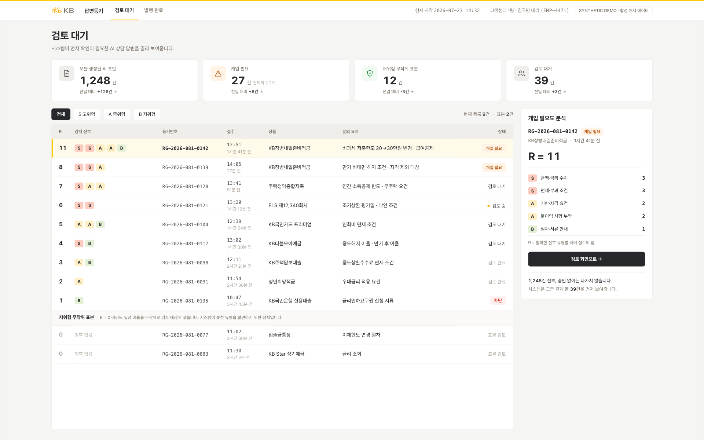
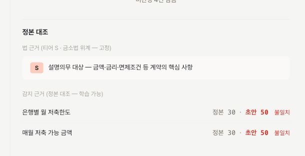
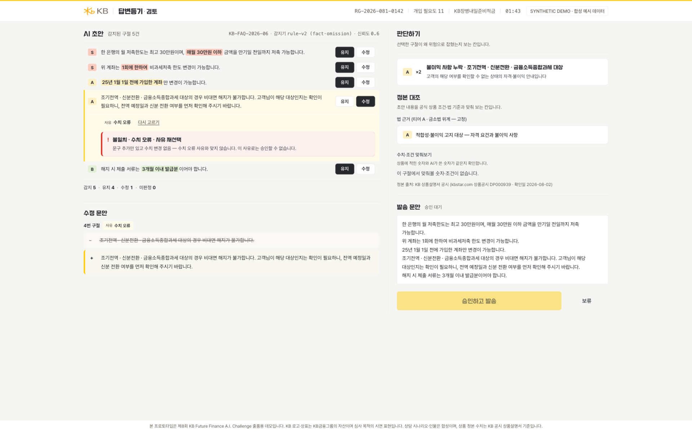
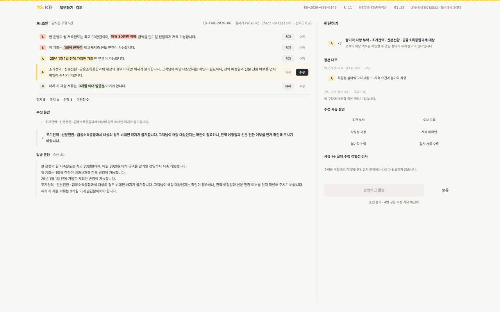
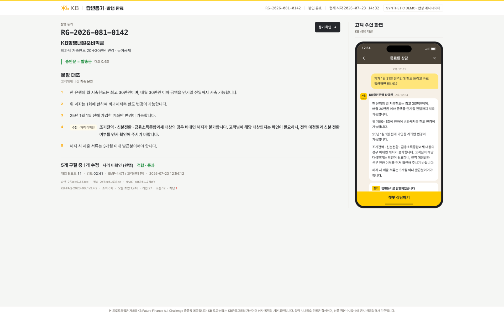
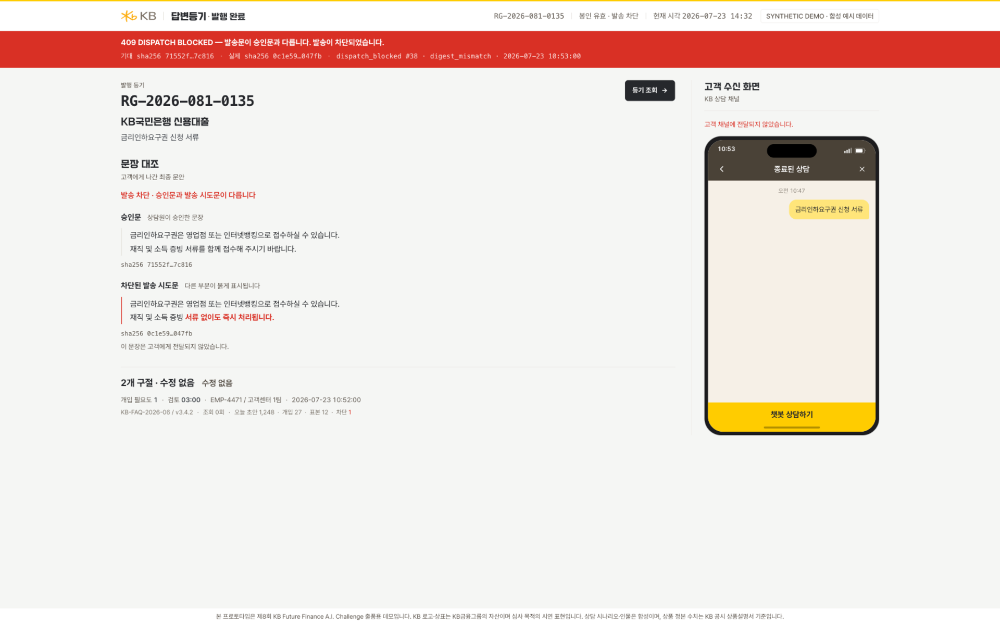
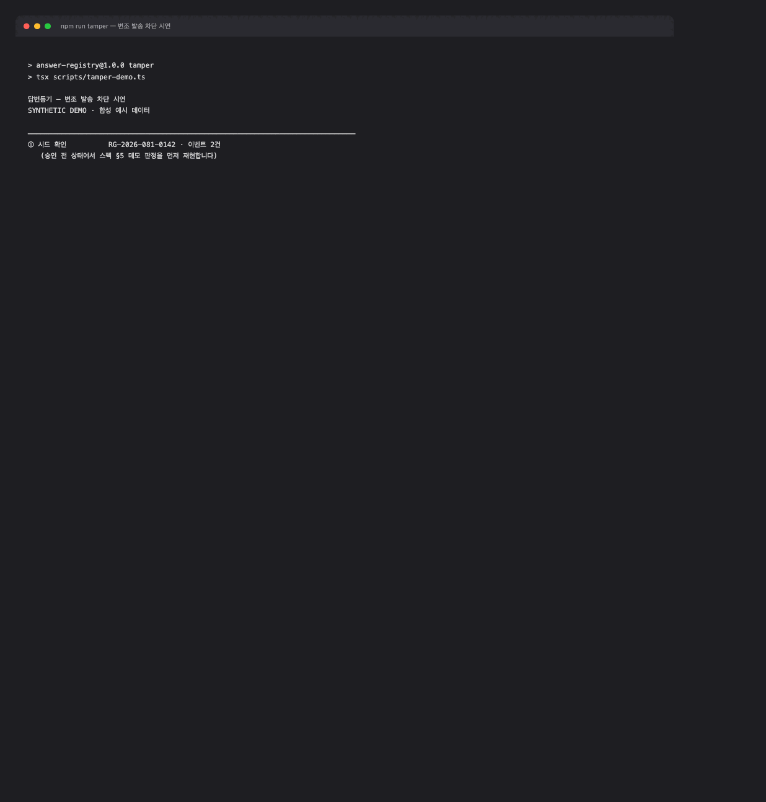
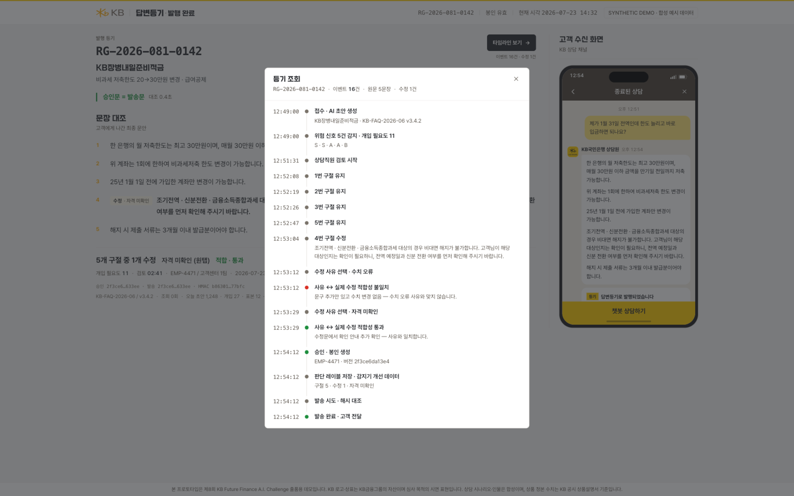

# 답변등기 (Answer Registry)

AI 상담 초안을 위험 순으로 골라주고, 상담직원이 문장 단위로 판단하면,
**승인한 문장 그대로만** 발송되는 은행 내부 검토 콘솔입니다.

KB AI Challenge 2026 출품작 · 팀 삼삼오오

> 본 프로토타입은 제8회 KB Future Finance A.I. Challenge 출품용 데모입니다.
> KB 로고·상표는 KB금융그룹의 자산이며 심사 목적의 시연 표현입니다.
> 상담 시나리오·인물은 합성이나, 상품 정본 수치는 KB 공시 상품설명서 기준입니다.
> 평가에 쓴 AI Hub 데이터는 원본을 포함하지 않고 파생 수치만 담았습니다.
> 외부 API·LLM 호출 없이 로컬에서만 동작합니다.

```bash
npm install          # 의존성 설치
npm run dev          # predev 로 seed 실행 → http://localhost:3000
npx vitest run       # 불변조건·게이트 테스트 60건
npm run tamper       # 변조 발송 차단 시연 (409)
```

**정적 데모(오프라인)** — 서버 없이 열어볼 수 있습니다.

```bash
npm run build:static && npx serve out
```

mock 이 없습니다. 이벤트 로그·봉인·해시 검증을 브라우저 WebCrypto로 실제 실행합니다.
다만 UI 를 거치지 않은 `curl` 차단 증명은 서버 모드의 테스트·`npm run tamper` 가 담당합니다.

설계 원칙은 하나입니다.
**되돌릴 수 있는 곳(감지·선별·설명)엔 AI를, 되돌릴 수 없는 곳(승인·발송)엔 결정론을.**

## 세 개의 숫자

| | 숫자 | 뜻 |
|---|---|---|
| 게이트 · 결정론 | **차단 100% · 재생 100%** | 승인문과 다른 문장은 발송되지 않고, 등기번호 하나로 전 과정이 복원됩니다. 테스트 60건이 강제합니다. |
| 부담 · 재배분 | **1,248건 중 39건 (3.1%)** | 전 건이 사람 승인을 거치되, 깊게 볼 곳은 시스템이 먼저 보여줍니다. |
| 감지기 · 학습층 | **합성 81.3%(상한) → 실상담 25.0%** | 감지 성능은 정본 팩트 커버리지의 함수입니다. 격차의 원인은 [숫자](#숫자--정직하게) 절에 있습니다. |

## 화면 흐름 — 데모 6막

`npm run dev` 후 http://localhost:3000 · 정본 케이스는 `RG-2026-081-0142` 입니다.

### 1막 — 큐가 순서를 정한다



오늘 초안 1,248건 전부, 승인 없이는 나가지 않습니다. 시스템은 그중 깊게 볼 39건을
먼저 보여주고, 맨 위 `R=11`이 어느 신호에서 몇 점씩 나왔는지 근거 문구와 함께 분해합니다.
목록 맨 아래에는 신호가 없는데도 뽑힌 **무작위 표본 레인**이 따로 있습니다 —
감지기가 놓치는 유형을 찾기 위한 장치입니다.

### 2막 — 문장 단위로 판단한다



구절마다 유지/수정을 판정합니다. `정본 대조` 블록이 초안 구절과 상품 정본 팩트를
나란히 놓고 어긋난 수치를 짚습니다. 위층은 법(금소법 위계 티어 S·A·B), 아래층은
감지(정본 대조) — 설명이 두 층으로 이루어집니다.

### 3막 — 틀린 사유는 승인을 막는다



수정 사유는 원탭으로 고릅니다. 사유와 실제 수정이 맞지 않으면(`수치 오류`를 골랐는데
수치 변경이 없으면) 승인 버튼이 잠깁니다. **틀린 시도는 지워지지 않고 로그에 남습니다.**



### 4막 — 승인문 그대로만 나간다



승인문과 발송문의 sha256이 같은 값으로 찍히고, 봉인(승인자·수정 사유·모델 버전)이
함께 남습니다. 발송된 등기는 재열람 시 편집이 잠기며([화면](verify-shots/m1-sealed-lock.png)),
`keep`·`edit`·`reason` API도 서버가 409 `case_sealed`로 거부합니다.

### 5막 — 한 글자만 바꿔도 차단된다



`npm run tamper`가 승인문의 `30만원`을 `50만원`으로 바꾼 문안을 발송 경로에 밀어
넣습니다. 결과는 **409 + `dispatch_blocked{digest_mismatch}`**. UI를 거치지 않은
`curl`도 같은 응답을 받습니다 — 검증이 화면이 아니라 발송 경로에 있기 때문입니다.



### 6막 — 등기번호 하나로 전 과정을 되돌린다



접수부터 발송까지의 타임라인이 열립니다. 3막의 사유 오선택과 재판단(`12:53:12` 불일치 →
`12:53:29` 통과)까지 그대로 들어 있습니다. 지울 수 없는 기록이라서, 믿을 수 있는 기록입니다.
`curl localhost:3000/api/registry/RG-2026-081-0142`

## 보장 — 불변조건 4

| 불변조건 | 어디서 강제하나 |
|---|---|
| 유효한 승인 없이는 발송 불가 | `POST /api/dispatch` — 409 `dispatch_blocked{no_valid_approval}` |
| 승인 후 내용이 바뀌면 승인 즉시 무효 | 구절 변경 직후 서버가 `approval_invalidated` append |
| 발송문 ≠ 승인문이면 차단 (curl 포함) | 서버가 digest 재계산 — 409 `dispatch_blocked{digest_mismatch}` |
| 등기번호 하나로 전 과정 복원 | `GET /api/registry/[caseId]` — 이벤트 재생 |

전부 `tests/`에서 route handler를 직접 호출해 검증합니다(60건 green,
[실행 캡처](docs/evidence-invariants-green.png)). UI를 거치지 않아도 같은 결과가
나온다는 것이 요점입니다.

## 숫자 — 정직하게

합성 벤치마크 240건(양성 48 · 큐 자리 39 → **이론상 최대 recall 81.25%**):

| 감지기 · 랭킹 | Recall@39 | Precision@39 |
|---|---|---|
| v1 · R | 22.9% | 28.2% |
| v2 · R+confirmedHits | **81.3% (상한 도달)** | **100%** |
| 편집거리 baseline | 22.9% | 28.2% |
| 무작위 (1,000회 평균) | 16.4% | 20.2% |

같은 설계를 실상담(AI Hub 「금융분야 고객상담 데이터」 은행 45,000건 중 표본)으로 다시 재면:

| 감지기 · 랭킹 | Recall@39 | Precision@39 |
|---|---|---|
| v2 · R+confirmedHits | **25.0% (무작위의 1.5배)** | 30.8% |
| 무작위 (1,000회 평균) | 16.2% | 20.0% |

이 격차에서 세 가지가 확인됩니다.

1. 유형별로 보면 수치 바꿔치기는 잡고(4/8) 삭제형은 놓칩니다(자격 요건 0/8).
   실상담 정본은 모범답변에서 **수치 슬롯만 자동 추출**했고 조건·필수요소 지식은
   비워뒀기 때문입니다. 감지 성능은 알고리즘이 아니라 **정본 팩트 커버리지의 함수**이고,
   그 정본(상품원장·약관)은 은행 안에 있습니다.
2. 위험 문장을 통째로 지우면 신호도 사라져 R이 내려갑니다 — 저위험 무작위 표본
   레인의 존재 근거를 우리 평가가 실증했습니다.
3. 오류 주입기와 감지기가 같은 문서를 참조하므로 합성 수치는 상한으로 읽어야 합니다.
   `docs/eval-results*.json`에 caveat까지 그대로 남겼습니다.

실상담 트랙(선택) — 원본은 재배포 금지라 저장소에 없고, 파생 수치만 남습니다:

```bash
npm run aihub:load -- --limit 200 --print   # data/aihub/ 에 배치 후 파싱 확인
npm run eval -- --aihub                     # → docs/eval-results-aihub.json
npm run aihub:stats                         # 주제별 민감 영역 비중 (실측 36.6%)
npm run seed -- --aihub                     # 실상담 재구성 케이스로 큐 채우기
```

## 구조

```
src/app/            화면 3 (큐 · 검토 · 발행 완료) + 발행 후 재열람 잠금
src/app/api/        route handlers — 승인·발송 게이트는 전부 서버
src/lib/            digest · seal · scoring · coherence · projection
src/lib/static-demo 오프라인 단독 실행 모드 (브라우저 WebCrypto)
src/fixtures/       합성 상담 20건 + 상품 정본 팩트
scripts/            seed · eval · tamper-demo · aihub 로더/통계
tests/              불변조건 · 봉인 · 사유 재선택 · 학습 신호 · 감지기 회귀 (60건)
```

이벤트 로그가 유일한 진실입니다. `events` 테이블 하나뿐이고 `src/lib/db.ts`에는
UPDATE/DELETE 함수 자체가 없습니다. 상태는 `projection.ts`가 이벤트를 처음부터
재생해서 만들고, 승인 무효화조차 `approval_invalidated` 이벤트를 새로 쌓는 방식입니다.

봉인은 다음과 같이 만듭니다.

```
contentDigest = sha256( NFC(승인문).replaceAll("\r\n", "\n") )
seal          = HMAC_SHA256(SEAL_SECRET,
                  caseId ‖ versionId ‖ contentDigest ‖ 승인자 ‖ 사유 ‖ 모델버전 ‖ 봉인시각)
```

정규화 덕분에 줄바꿈·유니코드 형태가 달라도 같은 내용이면 통과하고,
한 글자가 바뀌면 다이제스트가 달라져 차단됩니다.

## 감지기의 현재와 다음

감지기는 현재 규칙 기반이며, 의미 모델이 들어갈 자리는 M1·M3 입니다.
그 자리는 코드에 이미 열려 있습니다 — 판정 이력을 남기는 `DETECTOR_VERSION` 상수,
정본을 외부에서 주입받는 `detectDraftWithFacts()` 진입점, 그리고 어떤 감지기를 꽂아도
같은 시험지로 채점하는 `npm run eval` 벤치마크입니다. 승인·발송 게이트는 이 교체와
무관하게 결정론으로 남습니다.

## 만들지 않은 것

로그인·권한, 실제 LLM 연동, 실채널 발송, 관리자 설정 화면.
그리고 **무응답 타임아웃 자동 승인은 어떤 형태로도 넣지 않았습니다.**
승인은 사람이 판정을 끝내야만 생깁니다.

## 문서

- 구현 정본: [docs/BUILD_SPEC.md](docs/BUILD_SPEC.md)
- 작업 기록(append-only): [docs/WORKLOG.md](docs/WORKLOG.md)
- 평가 결과: [docs/eval-results.json](docs/eval-results.json) · [docs/eval-results-aihub.json](docs/eval-results-aihub.json) · [docs/aihub-stats.json](docs/aihub-stats.json)
- 테스트: `npx vitest run` — 불변조건 4 · 승인 게이트 · 봉인 잠금 · 사유 재선택 · 학습 신호 · 감지기 회귀
